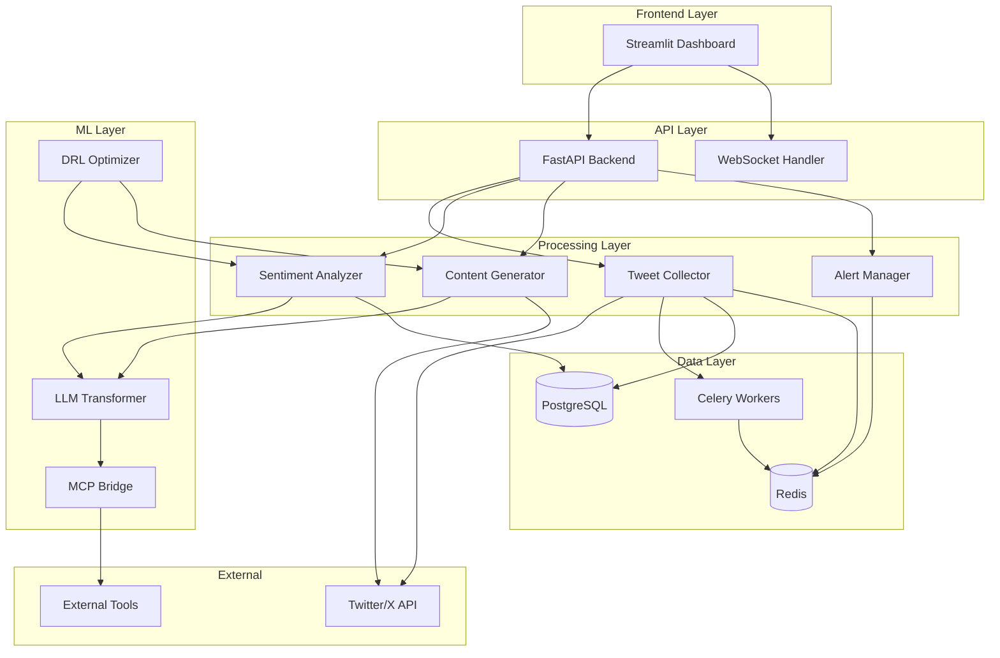

# Document de Design - SentiFlow

## Vue d'Ensemble

SentiFlow est une plateforme d'analyse de sentiments Twitter/X construite avec une architecture modulaire et scalable. Le système combine un LLM développé from scratch, un module de Deep Reinforcement Learning, et une intégration MCP pour offrir des capacités avancées d'analyse et de génération de contenu.

### Objectifs Architecturaux

- **Modularité** : Chaque composant est indépendant et testable
- **Scalabilité** : Support de millions de tweets via pipeline temps réel
- **Extensibilité** : Architecture MCP pour intégration d'outils externes
- **Performance** : Latence < 5s entre collecte et analyse

## Architecture



## Composants et Interfaces

### 1. Tweet Collector

```python
from abc import ABC, abstractmethod
from dataclasses import dataclass
from datetime import datetime
from typing import List, Optional, AsyncIterator
from enum import Enum

class FilterType(Enum):
    HASHTAG = "hashtag"
    ACCOUNT = "account"
    KEYWORD = "keyword"

@dataclass
class TweetFilter:
    filter_type: FilterType
    value: str
    language: Optional[str] = None
    min_engagement: int = 0

@dataclass
class Tweet:
    id: str
    text: str
    author_id: str
    author_username: str
    created_at: datetime
    likes: int
    retweets: int
    replies: int
    language: str
    hashtags: List[str]
    is_spam: bool = False

class ITweetCollector(ABC):
    @abstractmethod
    async def start_stream(self, filters: List[TweetFilter]) -> AsyncIterator[Tweet]:
        """Démarre la collecte en streaming avec les filtres spécifiés."""
        pass
    
    @abstractmethod
    async def fetch_historical(
        self, 
        filters: List[TweetFilter], 
        start_date: datetime, 
        end_date: datetime
    ) -> List[Tweet]:
        """Récupère les tweets historiques pour une période donnée."""
        pass
    
    @abstractmethod
    async def stop_stream(self) -> None:
        """Arrête la collecte en streaming."""
        pass

class ITweetRepository(ABC):
    @abstractmethod
    async def save(self, tweet: Tweet) -> None:
        """Sauvegarde un tweet dans PostgreSQL."""
        pass
    
    @abstractmethod
    async def save_batch(self, tweets: List[Tweet]) -> None:
        """Sauvegarde un batch de tweets."""
        pass
    
    @abstractmethod
    async def get_by_filter(
        self, 
        filters: List[TweetFilter], 
        start_date: datetime, 
        end_date: datetime,
        limit: int = 1000
    ) -> List[Tweet]:
        """Récupère les tweets selon les filtres."""
        pass
```

### 2. Sentiment Analyzer

```python
from dataclasses import dataclass
from typing import Dict, List
from enum import Enum
import numpy as np

class SentimentCategory(Enum):
    JOY = "joie"
    SADNESS = "tristesse"
    ANGER = "colère"
    FEAR = "peur"
    SURPRISE = "surprise"
    NEUTRAL = "neutre"

@dataclass
class SentimentResult:
    tweet_id: str
    dominant_sentiment: SentimentCategory
    scores: Dict[SentimentCategory, float]  # Score 0-1 pour chaque catégorie
    confidence: float
    embedding: np.ndarray  # Vecteur d'embedding du LLM
    processing_time_ms: float

@dataclass
class SentimentTimeSeries:
    timestamps: List[datetime]
    sentiment_counts: Dict[SentimentCategory, List[int]]
    interval: str  # "hour", "day", "week", "month"

class ISentimentAnalyzer(ABC):
    @abstractmethod
    async def analyze(self, tweet: Tweet) -> SentimentResult:
        """Analyse le sentiment d'un tweet unique."""
        pass
    
    @abstractmethod
    async def analyze_batch(self, tweets: List[Tweet]) -> List[SentimentResult]:
        """Analyse un batch de tweets."""
        pass
    
    @abstractmethod
    async def get_time_series(
        self,
        filters: List[TweetFilter],
        start_date: datetime,
        end_date: datetime,
        interval: str
    ) -> SentimentTimeSeries:
        """Génère une série temporelle des sentiments."""
        pass

class ISentimentRepository(ABC):
    @abstractmethod
    async def save(self, result: SentimentResult) -> None:
        """Sauvegarde un résultat d'analyse."""
        pass
    
    @abstractmethod
    async def get_distribution(
        self,
        filters: List[TweetFilter],
        start_date: datetime,
        end_date: datetime
    ) -> Dict[SentimentCategory, int]:
        """Récupère la distribution des sentiments."""
        pass
```

### 3. LLM Transformer (From Scratch)

```python
import torch
import torch.nn as nn
from dataclasses import dataclass
from typing import List, Optional, Tuple

@dataclass
class LLMConfig:
    vocab_size: int = 50000
    d_model: int = 512
    n_heads: int = 8
    n_layers: int = 6
    d_ff: int = 2048
    max_seq_length: int = 512
    dropout: float = 0.1

@dataclass
class LLMResponse:
    text: str
    confidence: float
    sources: List[str]  # IDs des tweets utilisés
    tool_calls: List[str]  # Outils MCP appelés

class ILanguageModel(ABC):
    @abstractmethod
    def forward(
        self, 
        input_ids: torch.Tensor, 
        attention_mask: Optional[torch.Tensor] = None
    ) -> torch.Tensor:
        """Forward pass du modèle."""
        pass
    
    @abstractmethod
    def generate(
        self, 
        prompt: str, 
        max_length: int = 256,
        temperature: float = 0.7
    ) -> str:
        """Génère du texte à partir d'un prompt."""
        pass
    
    @abstractmethod
    def get_embedding(self, text: str) -> torch.Tensor:
        """Retourne l'embedding d'un texte."""
        pass

class ILLM(ABC):
    @abstractmethod
    async def query(
        self, 
        question: str, 
        context: Optional[List[Tweet]] = None
    ) -> LLMResponse:
        """Répond à une question en langage naturel."""
        pass
    
    @abstractmethod
    async def analyze_sentiment(self, text: str) -> Dict[SentimentCategory, float]:
        """Analyse le sentiment d'un texte."""
        pass
```

### 4. Content Generator

```python
@dataclass
class GeneratedContent:
    text: str
    character_count: int
    based_on_tweets: List[str]  # IDs des tweets sources
    sentiment_summary: Dict[SentimentCategory, float]
    suggested_hashtags: List[str]
    confidence: float
    warnings: List[str]  # Avertissements (contenu sensible, etc.)

@dataclass
class PublicationResult:
    tweet_id: str
    published_at: datetime
    content: str
    success: bool
    error_message: Optional[str] = None

class IContentGenerator(ABC):
    @abstractmethod
    async def generate(
        self,
        filters: List[TweetFilter],
        style: str = "informative",
        max_length: int = 280
    ) -> GeneratedContent:
        """Génère du contenu basé sur les analyses."""
        pass
    
    @abstractmethod
    async def publish(
        self,
        content: GeneratedContent,
        account_credentials: dict
    ) -> PublicationResult:
        """Publie le contenu sur Twitter/X."""
        pass

class IPublicationRepository(ABC):
    @abstractmethod
    async def save(self, result: PublicationResult) -> None:
        """Sauvegarde l'historique de publication."""
        pass
    
    @abstractmethod
    async def get_history(
        self,
        start_date: datetime,
        end_date: datetime
    ) -> List[PublicationResult]:
        """Récupère l'historique des publications."""
        pass
```

### 5. Alert Manager

```python
from enum import Enum

class AlertConditionType(Enum):
    THRESHOLD = "threshold"  # Seuil dépassé
    TREND = "trend"  # Tendance détectée
    ANOMALY = "anomaly"  # Anomalie statistique

class NotificationChannel(Enum):
    EMAIL = "email"
    WEBHOOK = "webhook"
    DASHBOARD = "dashboard"

@dataclass
class AlertCondition:
    condition_type: AlertConditionType
    sentiment: Optional[SentimentCategory]
    threshold: Optional[float]
    direction: Optional[str]  # "above", "below", "increase", "decrease"
    window_minutes: int = 60

@dataclass
class Alert:
    id: str
    name: str
    filters: List[TweetFilter]
    conditions: List[AlertCondition]
    channels: List[NotificationChannel]
    is_active: bool
    created_at: datetime

@dataclass
class AlertTrigger:
    alert_id: str
    triggered_at: datetime
    condition_met: AlertCondition
    trigger_tweets: List[str]  # IDs des tweets déclencheurs
    metrics: Dict[str, float]

class IAlertManager(ABC):
    @abstractmethod
    async def create_alert(self, alert: Alert) -> str:
        """Crée une nouvelle alerte."""
        pass
    
    @abstractmethod
    async def update_alert(self, alert: Alert) -> None:
        """Met à jour une alerte existante."""
        pass
    
    @abstractmethod
    async def check_conditions(self, alert: Alert) -> Optional[AlertTrigger]:
        """Vérifie si les conditions d'une alerte sont satisfaites."""
        pass
    
    @abstractmethod
    async def send_notification(
        self,
        trigger: AlertTrigger,
        channels: List[NotificationChannel]
    ) -> None:
        """Envoie les notifications pour une alerte déclenchée."""
        pass
```

### 6. DRL Optimizer

```python
@dataclass
class DRLConfig:
    algorithm: str = "PPO"  # "PPO" ou "DQN"
    learning_rate: float = 3e-4
    gamma: float = 0.99
    epsilon: float = 0.2  # Pour PPO
    batch_size: int = 64
    update_frequency: int = 1000

@dataclass
class PublicationRecommendation:
    optimal_hour: int  # 0-23
    optimal_day: int  # 0-6 (lundi-dimanche)
    confidence: float
    expected_engagement: float
    factors: Dict[str, float]  # Facteurs de décision expliqués

@dataclass
class FilterRecommendation:
    spam_threshold: float
    relevance_threshold: float
    factors: Dict[str, float]

class IDRLOptimizer(ABC):
    @abstractmethod
    def train_step(
        self,
        state: torch.Tensor,
        action: torch.Tensor,
        reward: float,
        next_state: torch.Tensor
    ) -> float:
        """Effectue une étape d'entraînement."""
        pass
    
    @abstractmethod
    async def get_publication_recommendation(
        self,
        filters: List[TweetFilter]
    ) -> PublicationRecommendation:
        """Recommande le meilleur timing de publication."""
        pass
    
    @abstractmethod
    async def get_filter_recommendation(
        self,
        historical_data: List[Tweet]
    ) -> FilterRecommendation:
        """Recommande les seuils de filtrage optimaux."""
        pass
    
    @abstractmethod
    async def update_from_engagement(
        self,
        publication: PublicationResult,
        engagement_metrics: Dict[str, int]
    ) -> None:
        """Met à jour le modèle avec les métriques d'engagement."""
        pass
```

### 7. MCP Bridge

```python
from enum import Enum

class MCPToolType(Enum):
    WEB_SEARCH = "web_search"
    CALCULATOR = "calculator"
    DATABASE = "database"
    TWITTER_API = "twitter_api"

@dataclass
class MCPRequest:
    tool: MCPToolType
    parameters: Dict[str, any]
    timeout_seconds: int = 30

@dataclass
class MCPResponse:
    success: bool
    data: Optional[any]
    error: Optional[str]
    execution_time_ms: float

class IMCPBridge(ABC):
    @abstractmethod
    async def call_tool(self, request: MCPRequest) -> MCPResponse:
        """Appelle un outil externe via MCP."""
        pass
    
    @abstractmethod
    async def register_tool(
        self,
        tool_type: MCPToolType,
        endpoint: str,
        schema: Dict
    ) -> None:
        """Enregistre un nouvel outil."""
        pass
    
    @abstractmethod
    async def get_available_tools(self) -> List[MCPToolType]:
        """Liste les outils disponibles."""
        pass
    
    @abstractmethod
    async def health_check(self, tool: MCPToolType) -> bool:
        """Vérifie la disponibilité d'un outil."""
        pass
```

## Modèles de Données

### Schéma PostgreSQL

```sql
-- Table des tweets
CREATE TABLE tweets (
    id VARCHAR(64) PRIMARY KEY,
    text TEXT NOT NULL,
    author_id VARCHAR(64) NOT NULL,
    author_username VARCHAR(255) NOT NULL,
    created_at TIMESTAMP WITH TIME ZONE NOT NULL,
    likes INTEGER DEFAULT 0,
    retweets INTEGER DEFAULT 0,
    replies INTEGER DEFAULT 0,
    language VARCHAR(10),
    hashtags TEXT[],
    is_spam BOOLEAN DEFAULT FALSE,
    collected_at TIMESTAMP WITH TIME ZONE DEFAULT NOW(),
    INDEX idx_tweets_created_at (created_at),
    INDEX idx_tweets_author (author_id),
    INDEX idx_tweets_hashtags USING GIN (hashtags)
);

-- Table des analyses de sentiments
CREATE TABLE sentiment_analyses (
    id SERIAL PRIMARY KEY,
    tweet_id VARCHAR(64) REFERENCES tweets(id),
    dominant_sentiment VARCHAR(20) NOT NULL,
    joy_score FLOAT NOT NULL,
    sadness_score FLOAT NOT NULL,
    anger_score FLOAT NOT NULL,
    fear_score FLOAT NOT NULL,
    surprise_score FLOAT NOT NULL,
    neutral_score FLOAT NOT NULL,
    confidence FLOAT NOT NULL,
    embedding BYTEA,  -- Vecteur sérialisé
    processing_time_ms FLOAT,
    analyzed_at TIMESTAMP WITH TIME ZONE DEFAULT NOW(),
    INDEX idx_sentiment_tweet (tweet_id),
    INDEX idx_sentiment_dominant (dominant_sentiment),
    INDEX idx_sentiment_analyzed_at (analyzed_at)
);

-- Table des alertes
CREATE TABLE alerts (
    id UUID PRIMARY KEY DEFAULT gen_random_uuid(),
    name VARCHAR(255) NOT NULL,
    filters JSONB NOT NULL,
    conditions JSONB NOT NULL,
    channels TEXT[] NOT NULL,
    is_active BOOLEAN DEFAULT TRUE,
    created_at TIMESTAMP WITH TIME ZONE DEFAULT NOW(),
    updated_at TIMESTAMP WITH TIME ZONE DEFAULT NOW()
);

-- Table des déclenchements d'alertes
CREATE TABLE alert_triggers (
    id SERIAL PRIMARY KEY,
    alert_id UUID REFERENCES alerts(id),
    triggered_at TIMESTAMP WITH TIME ZONE DEFAULT NOW(),
    condition_met JSONB NOT NULL,
    trigger_tweets TEXT[],
    metrics JSONB,
    INDEX idx_trigger_alert (alert_id),
    INDEX idx_trigger_time (triggered_at)
);

-- Table des publications
CREATE TABLE publications (
    id SERIAL PRIMARY KEY,
    tweet_id VARCHAR(64),
    content TEXT NOT NULL,
    published_at TIMESTAMP WITH TIME ZONE,
    success BOOLEAN NOT NULL,
    error_message TEXT,
    engagement_likes INTEGER DEFAULT 0,
    engagement_retweets INTEGER DEFAULT 0,
    engagement_replies INTEGER DEFAULT 0,
    created_at TIMESTAMP WITH TIME ZONE DEFAULT NOW()
);

-- Table des configurations utilisateur
CREATE TABLE user_configs (
    id SERIAL PRIMARY KEY,
    twitter_credentials JSONB,  -- Chiffré
    notification_settings JSONB,
    filter_presets JSONB,
    created_at TIMESTAMP WITH TIME ZONE DEFAULT NOW(),
    updated_at TIMESTAMP WITH TIME ZONE DEFAULT NOW()
);
```

### Structure Redis

```python
# Clés Redis pour le cache et temps réel

# Cache des tweets récents (TTL: 1 heure)
# Key: tweets:recent:{filter_hash}
# Value: List[Tweet] sérialisé en JSON

# Compteurs temps réel par sentiment
# Key: sentiment:count:{sentiment}:{hour}
# Value: Integer (compteur)

# File d'attente des tweets à analyser
# Key: queue:tweets:analyze
# Type: List (FIFO)

# État des alertes actives
# Key: alerts:active:{alert_id}
# Value: Alert sérialisé en JSON

# Cache des embeddings LLM
# Key: embeddings:{tweet_id}
# Value: numpy array sérialisé

# Sessions utilisateur
# Key: session:{session_id}
# Value: Dict avec contexte de session
```

## Propriétés de Correction

*Une propriété est une caractéristique ou un comportement qui doit rester vrai pour toutes les exécutions valides du système - essentiellement, une déclaration formelle de ce que le système doit faire. Les propriétés servent de pont entre les spécifications lisibles par l'humain et les garanties de correction vérifiables par la machine.*

